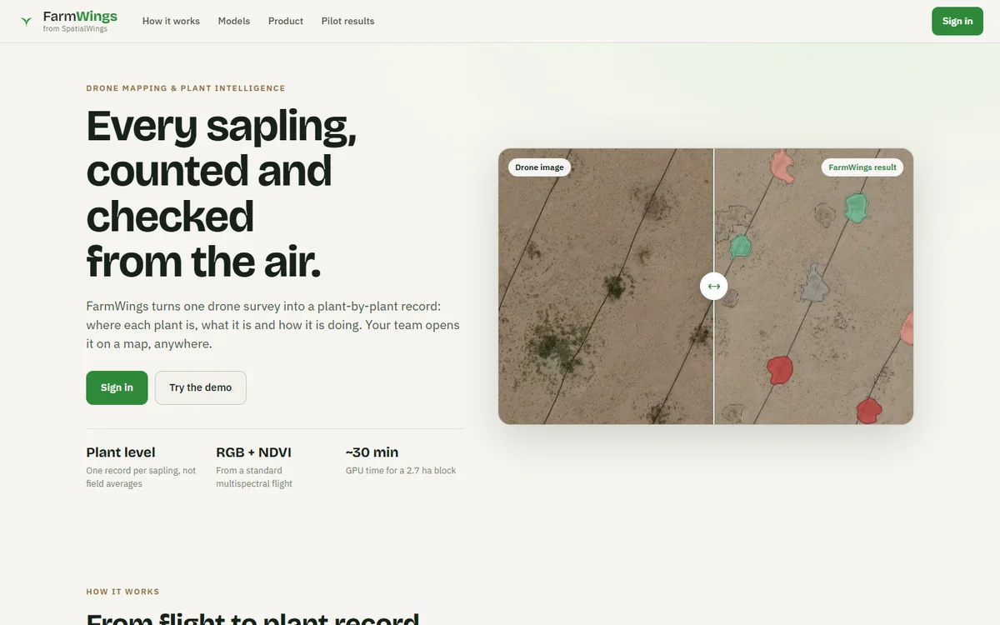
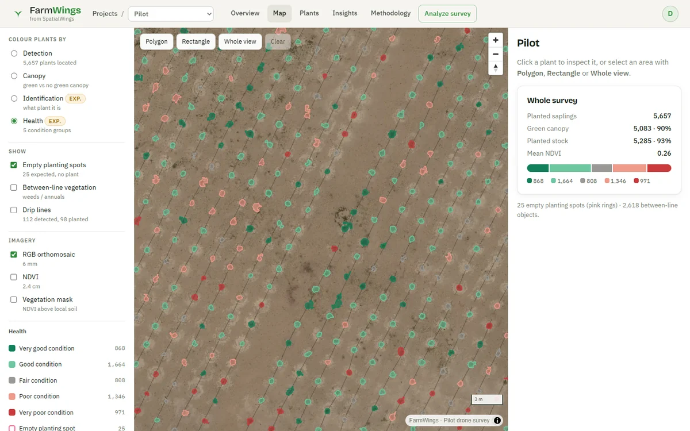

<div align="center">

# 🌱 FarmWings

<sub>from SpatialWings</sub>

**Every sapling, counted and checked from the air.**

[Live app](https://athithyai.github.io/FarmWings/) · [Docs](docs/) · [License](LICENSE)

</div>



FarmWings turns one drone survey (RGB orthomosaic + NDVI raster) into a plant-by-plant record:
where each plant is, what it is, and how it is doing, on a map-first web app.

## Models

| Step | Models | Output |
|---|---|---|
| Detection | SAM 2.1 outlines plants on 1.2 cm imagery; drip lines and the planting rhythm assign one plant per planting spot | location, outline, empty spots |
| Identification *(experimental)* | DINOv3 ViT-L SAT-493M embedding + logistic-regression classifier | planted stock vs other vegetation; the species name comes from the planting record, not the imagery |
| Health *(experimental)* | DINOv3 embedding + NDVI/colour indicators → Gaussian mixture (unsupervised) | 5 condition groups, green canopy |

Built with DINOv3.

## Pilot results

2.66 ha revegetation block, *Rhanterium epapposum*, RGB 6 mm, NDVI 2.4 cm.

| | |
|---|---|
| Planting spots | **5,682** on 98 planting lines (installation record: 5,684) |
| Plants located | **5,657** (99.6%) · 25 empty spots |
| Green canopy | **5,083** (89.9%) · 574 without green canopy |
| Recognised as planted stock | **5,285** (93.4% of located plants) |
| Condition groups | Very good 868 · Good 1,664 · Fair 808 · Poor 1,346 · Very poor 971 |
| Agreement with installation record | 99.5% of plants on a recorded point · 99.0% of points found · median offset 5.6 cm |



**Caveats.** No field-verified plant list exists: accuracy is measured against the installation record,
which is a reference, not ground truth. Identification and health are experimental. Health groups are
relative to this survey and are not a disease diagnosis. Details: [limitations](docs/limitations.md).

## Run

```bash
npm install && npm run build && npm run preview       # web app → http://localhost:4173
python processing/run_pipeline.py --input <folder>     # full pipeline on an RGB + NDVI pair
python server/app.py                                   # compute node for uploads (NVIDIA GPU)
```

Sign-in: put a Google OAuth client ID in [`public/config.json`](public/config.json); until then the app offers demo access.
The compute node verifies Google sign-in itself: `python server/app.py --google-client-id <id> --allow you@example.com`.

## Cloud requirements and costs

| Component | Option | Cost estimate |
|---|---|---|
| Web app | GitHub Pages (static) | Free |
| Basemap | OpenFreeMap (OpenStreetMap data) | Free |
| Storage | S3 Standard / Azure Blob Hot, ~1.5 GB per 2.7 ha block | ~$0.04 per block per month |
| GPU compute | AWS g6.xlarge (NVIDIA L4 24 GB), ~30 min per block | ~$0.40 per block ($0.805/h) |
| GPU compute, budget | RunPod L4 / RTX 4090 | ~$0.20–0.35 per block |
| GPU compute, own | NVIDIA GPU ≥ 8 GB | Free |

Minimum node: NVIDIA GPU 8 GB, 4 vCPU, 16 GB RAM, 10 GB disk per block, Python 3.13, PyTorch 2.11 (CUDA).
Prices are 2026 on-demand list prices; check with the provider before budgeting.

## Docs

[Data inventory](docs/data-inventory.md) · [Model evaluation](docs/model-evaluation.md) · [Processing](docs/processing.md) ·
[Limitations](docs/limitations.md) · [Future architecture](docs/architecture-future.md)

## License

Source-available, all rights reserved: you may read this repository, but using, copying or modifying it
needs written permission. The Pilot imagery and results are project data and are not licensed for any use.
See [LICENSE](LICENSE). Third-party components keep their own licences: [THIRD_PARTY_NOTICES.md](THIRD_PARTY_NOTICES.md).
