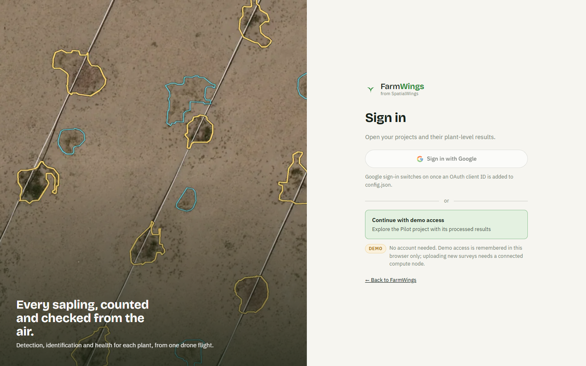
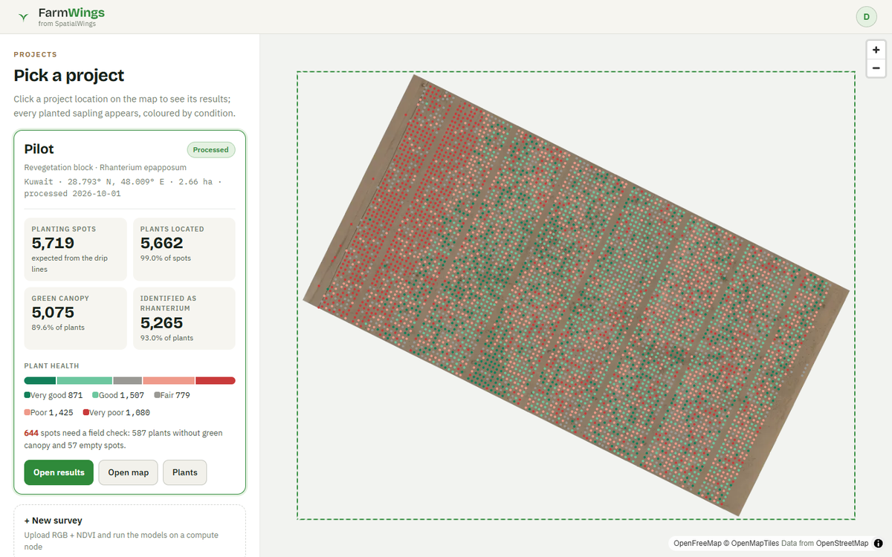
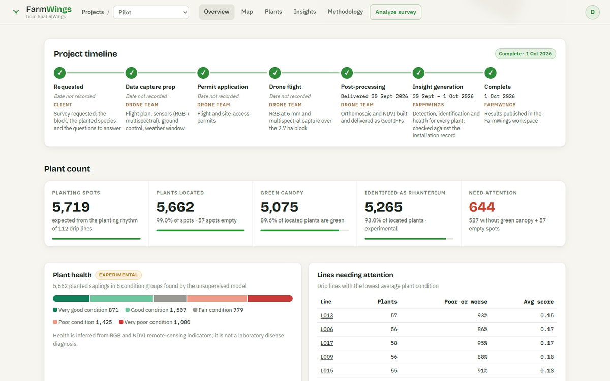
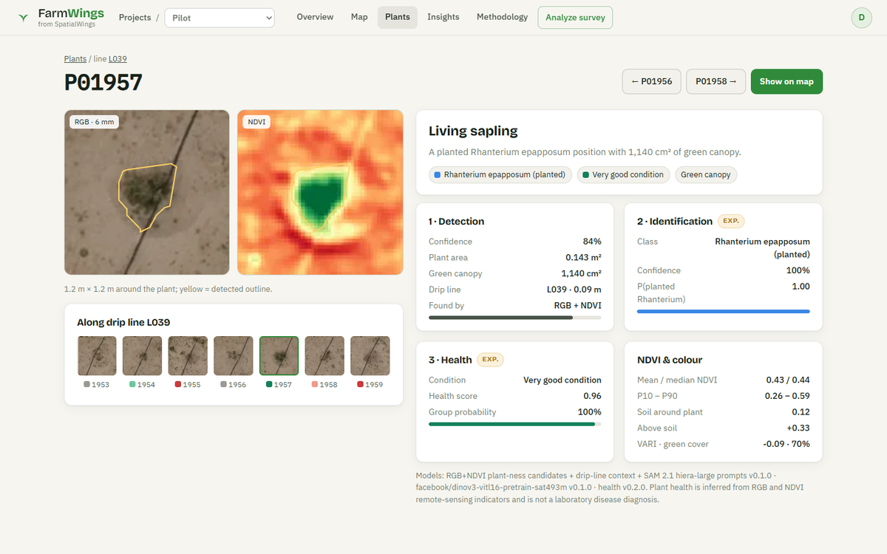
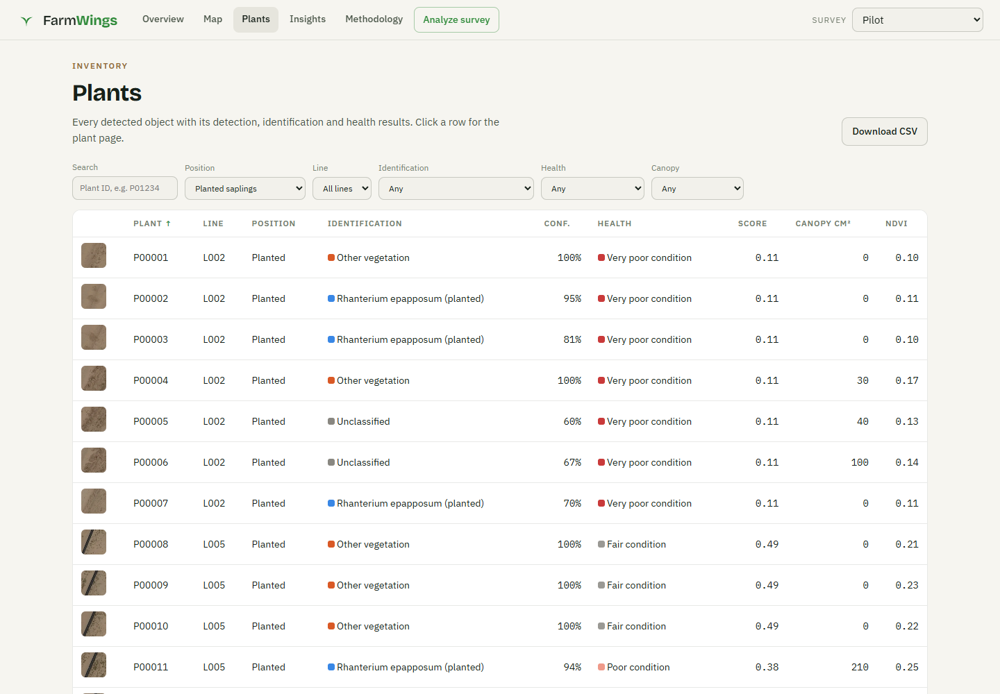
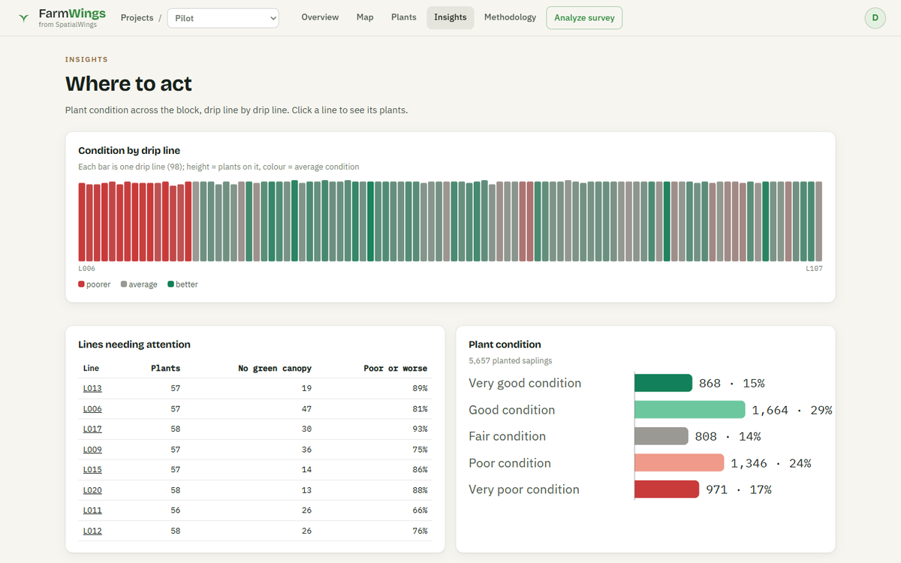
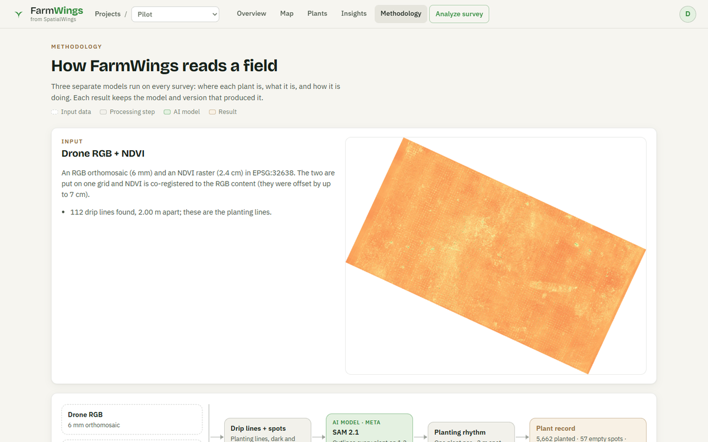
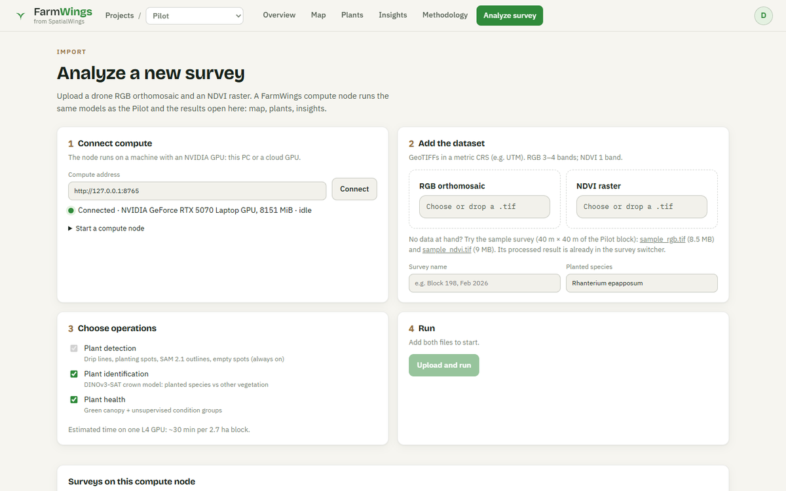
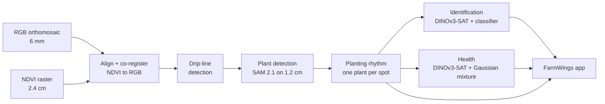
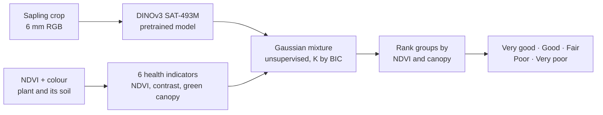

<div align="center">

# 🌱 FarmWings

<sub>from SpatialWings</sub>

**Drone Mapping & Plant Intelligence**

Every sapling in a planting block, found from drone imagery and assessed one by one:
*where it is, what it is, and how it is doing.*

**[Open the live app →](https://athithyai.github.io/FarmWings/)**

</div>


FarmWings turns a drone **RGB orthomosaic** and an **NDVI raster** into a plant-by-plant inventory. It runs three
separate models (detection, identification and health) and presents the results as a map-first web app.
New surveys are imported in the app and processed on a GPU **compute node** (your own PC or a cloud GPU).

---

## The product flow

| 1 · Landing | 2 · Sign in |
|---|---|
| <br/><sub>Public page: the solution on one real field patch (drone image → NDVI → plants → identity → health) and a diagram of every model</sub> | <br/><sub><b>Sign in with Google</b> (once a client ID is configured) or <b>Continue with demo access</b>, clearly labelled</sub> |
| **3 · Pick a project** | **4 · Project results** |
| <br/><sub>Project locations on a map. Clicking the Pilot flies to the site, shows every sapling coloured by condition and the headline numbers</sub> | <br/><sub>The project workspace opens on the <b>project timeline</b> (requested → capture prep → permit → flight → post-processing → insights → complete) and the plant count; then Map, Plants, Insights, Methodology, Analyze survey</sub> |

## The Pilot at a glance

A 2.66 ha drip-irrigated revegetation block planted with *Rhanterium epapposum*, flown at **6 mm** (RGB) and **2.4 cm** (NDVI).

| | |
|---|---|
| **Planting spots** (from the planting rhythm of 112 drip lines, 2.0 m apart) | **5,719** |
| **Plants located** | **5,662** (99.0%) · 57 spots empty |
| **Green living canopy** | **5,075** (89.6% of located plants) |
| **No green canopy** (dry, dormant or dead: field check) | **587** |
| **Identified as *Rhanterium epapposum*** *(experimental)* | **5,265** (93.0%) |
| **Health** *(experimental, 5 unsupervised condition groups)* | Very good 871 · Good 1,507 · Fair 779 · Poor 1,425 · Very poor 1,080 |

<table>
<tr>
<td width="50%"><br/><sub><b>Map</b>: every plant coloured by detection, canopy, identity or health; draw an area to get its numbers</sub></td>
<td width="50%"><br/><sub><b>Plant page</b>: drone crops with the detected outline, and all three model results</sub></td>
</tr>
<tr>
<td width="50%"><br/><sub><b>Plants</b>: searchable inventory with a thumbnail per plant, CSV export</sub></td>
<td width="50%"><br/><sub><b>Insights</b>: condition along every drip line, lines needing attention</sub></td>
</tr>
<tr>
<td width="50%"><br/><sub><b>Methodology</b>: a diagram per model with this survey's numbers</sub></td>
<td width="50%"><br/><sub><b>Analyze</b>: connect compute, upload RGB + NDVI, choose operations, run</sub></td>
</tr>
</table>

---

## How it works



| Stage | Models | Method | Output |
|---|---|---|---|
| **1 · Detection** | **SAM 2.1** hiera-large (Meta) | RGB darkness + NDVI candidates → SAM 2.1 outlines on 1.2 cm imagery; an NDVI recall pass catches green saplings the first pass missed; objects are assigned to visible drip lines and a **planting-rhythm fit** keeps one plant per planting spot | plant outline, confidence, planting line, empty spots |
| **2 · Identification** *(experimental)* | **DINOv3 ViT-L SAT-493M** (Meta, pretrained on 493 M satellite images) + **logistic-regression classifier** | Crown crop (drip line removed) → DINOv3 embedding + NDVI / colour / shape → classifier trained on labels from the planting layout | species vs other vegetation, confidence |
| **3 · Health** *(experimental)* | **DINOv3 ViT-L SAT-493M** + **Gaussian mixture model** (unsupervised) | Crown embedding (PCA 16) + six NDVI / colour indicators → Gaussian mixture, K chosen by BIC → groups ranked by NDVI and green canopy; green canopy = NDVI ≥ 0.20 above the plant's own soil | condition group, score, canopy area |

### The health model

Health *is* model-based: a pretrained vision model describes each sapling and an unsupervised model groups them.
No field health labels exist yet, so the groups are found in the data rather than learned from examples.



With **100–300 field-scored plants** (e.g. healthy / stressed / dead), the same features train a *supervised* health
classifier; the app and the pipeline stay the same.

Every result carries the model and version that produced it. Details: [docs/model-evaluation.md](docs/model-evaluation.md).

### How accurate is it?

There is no field-verified plant list, so accuracy was checked in two independent ways:

- **Project installation record** (5,684 planting points, used as a *reference*, not as ground truth):
  **99.1%** of FarmWings plants sit on a recorded spot, **98.7%** of recorded spots have a FarmWings plant,
  median position difference **5.5 cm**.
- **Visual audits** of the 6 mm imagery wherever the two disagree. About half of the spots the reference
  marks as planted but FarmWings leaves empty show no living plant at all. And where the reference marks
  a plant "not detected", FarmWings usually finds the planting pit and reports it as *no green canopy*.

Identification: spatial cross-validation AUC **0.991**. Health: groups stable on resampling (ARI **0.82**) and
consistent with a transparent NDVI/RGB vigour index (ρ **0.92**).
*Plant health is inferred from RGB and NDVI remote-sensing indicators and is not a laboratory disease diagnosis.*

---

## Use it

### 1. Explore the results

Open **[the live app](https://athithyai.github.io/FarmWings/)** → **Sign in** (Google) or **Try the demo** →
click the **Pilot** on the project map → **Open results**. The project bar (*Projects / Pilot*) also switches to the
bundled **Sample survey** (40 m × 40 m) and to any survey finished on a connected compute node.

**Project timeline.** Each project opens on its timeline: Requested, Data capture prep, Permit application, Drone flight,
Post-processing, Insight generation, Complete, each with its owner (client, drone team, FarmWings), date and status.
The dates live in `timeline.json` next to the survey's results (Pilot: [`public/data/timeline.json`](public/data/timeline.json));
`null` shows as *Date not recorded*, and `status` can be `done`, `current` or `upcoming`. The Pilot's survey files carry no
request, permit or flight dates, so those steps stay blank until they are filled in. Surveys without the file show
the same steps with the FarmWings processing date.

### 2. Process your own survey

1. **Start a compute node** on a machine with an NVIDIA GPU (see requirements below):
   ```bash
   python server/app.py                       # http://127.0.0.1:8765
   ```
2. In the app, go to **Analyze survey**, connect to the node, add the **RGB** and **NDVI** GeoTIFFs, choose the
   operations (detection is always on; identification and health are optional) and press **Upload and run**.
3. Follow the progress per stage; when it is ready, **Open results**. The survey appears in every screen.

No data at hand? Download the sample survey from the Analyze screen (`sample_rgb.tif`, `sample_ndvi.tif`).

### 3. Or run the pipeline from the command line

```bash
python processing/run_pipeline.py --input path/to/survey_folder --project "Block 198" --species "Rhanterium epapposum"
python processing/run_pipeline.py --only health          # re-run one stage
python processing/run_pipeline.py --skip identify,health # detection only
```

---

## Connecting a data source

| Source | How FarmWings reads it |
|---|---|
| **Drone photogrammetry** (Pix4D, DJI Terra, Agisoft Metashape, DroneDeploy exports) | Export the RGB orthomosaic and the NDVI (or multispectral index) raster as **GeoTIFF**, same projected CRS (e.g. UTM). Upload both in **Analyze survey**. |
| **Local / network folder** | Point the CLI at a folder with one RGB `.tif` and one `*ndvi*.tif`: `run_pipeline.py --input <folder>`. |
| **Cloud storage** (S3 · Azure Blob · GCS) | Sync the survey folder to the compute node, then run: `aws s3 sync s3://bucket/survey ./in` · `azcopy sync <url> ./in` · `gsutil rsync -r gs://bucket/survey ./in`. Results in `web/` can be synced back to the bucket and served statically. |
| **Mapping platforms / APIs** (future) | A webhook on "processing finished" calls the compute node's `POST /api/jobs` with the file URLs. See [docs/architecture-future.md](docs/architecture-future.md). |

Input checks happen on upload: both files must be readable GeoTIFFs in the **same metric CRS**; RGB needs 3–4 bands and NDVI 1 band.

---

## Cloud requirements and costs

| Component | What it does | Recommended option | Size / time | Cost estimate |
|---|---|---|---|---|
| **Web app** | The FarmWings app (static) | GitHub Pages | ~60 MB per survey | **Free** |
| **Basemap** | Project-location map | OpenFreeMap vector tiles (OpenStreetMap data, no key) | per view | **Free** |
| **Storage** | RGB + NDVI GeoTIFFs and results | Amazon S3 Standard · Azure Blob Hot | ~1.5 GB per 2.7 ha block | $0.018–0.023 / GB-month → **~$0.04 per block per month** |
| **GPU compute** | Full pipeline (SAM 2.1, DINOv3, health) | AWS **g6.xlarge** (NVIDIA L4, 24 GB) | ~30 min per 2.7 ha block | $0.805 / h on demand → **~$0.40 per block** |
| **GPU compute (budget)** | Same pipeline, rented GPU | RunPod L4 / RTX 4090 | ~30 min per block | $0.34–0.74 / h → **~$0.20–0.35 per block** |
| **GPU compute (alternative)** | Same pipeline | AWS g5.xlarge (A10G, 24 GB) | ~30 min per block | $1.006 / h → ~$0.50 per block |
| **GPU compute (own)** | Your PC, NVIDIA GPU ≥ 8 GB | FarmWings compute node | ~30 min per block (RTX 5070 laptop) | **Free** (electricity) |
| **Job API** | Upload, queue, results (`server/app.py`) | Runs on the GPU machine | 1 process | Included |
| **Sign-in** | Sign in with Google + e-mail allow-list | Google Identity Services | per user | **Free** |

*On-demand list prices, us-east-1 / RunPod, 2026. Verify with the provider before budgeting.*
Example programme: **41 blocks** of this size ≈ 20 GPU-hours ≈ **$16** on AWS L4 (or ≈ $8 on RunPod), plus ≈ **$2 / month** storage.

### Compute needed for deployment

| | Minimum | Recommended |
|---|---|---|
| GPU | NVIDIA, 8 GB VRAM, CUDA 12 | NVIDIA L4 / A10G, 24 GB |
| CPU / RAM | 4 vCPU / 16 GB | 8 vCPU / 32 GB (the Pilot was processed with 32 GB) |
| Disk | 10 GB per block while processing | 50 GB SSD |
| Software | Python 3.13, PyTorch 2.11 (CUDA), `requirements.txt`, model weights from Hugging Face (SAM 2.1 hiera-large, DINOv3 ViT-L SAT-493M) | same, as a container image |
| Throughput | ~2 blocks / hour | scale out: one GPU worker per block |

The web app needs no server: any static host works (GitHub Pages, S3 + CloudFront, Azure Static Web Apps).

---

## Sign-in

There are two sign-in points, for two different jobs.

**The app (who opens the workspace).** The landing page is public; projects and results open after
**Sign in with Google** or **Continue with demo access** (labelled *Demo* in the app).

1. Google Cloud console → *APIs & Services → Credentials* → **Create OAuth client ID** (type *Web application*).
   Add the app origins, e.g. `https://athithyai.github.io` and `http://localhost:4173`, under *Authorized JavaScript origins*.
2. Put the client ID in [`public/config.json`](public/config.json) (`"google_client_id": "<id>.apps.googleusercontent.com"`)
   and push; the Google button switches on after the Pages deploy. Until then it shows as not configured and demo access works.

The app is a static site and the bundled Pilot data is public in this repository, so this sign-in is a front door,
not access control. Data that must stay private lives on a compute node:

**The compute node (who can upload and see new surveys).** The node verifies Google ID tokens itself.

```bash
python server/app.py --google-client-id <id>.apps.googleusercontent.com --allow you@example.com,@yourcompany.com
```

The app then shows the Google button on **Analyze survey**. The node checks the token's signature, audience,
expiry and verified e-mail against the allow-list before creating a 12-hour session.

---

## Repository

```
app/frontend/          FarmWings app: Vite + MapLibre; screens in src/views/ (landing, sign-in, projects, workspace)
processing/            pipeline stages (run_pipeline.py), make_showcase.py (landing visuals), experiments/
server/app.py          compute node: upload, job queue, sign-in, results
public/data/           bundled surveys (Pilot + sample) served by the app
public/showcase/       landing-page visuals: one field patch per pipeline step, workspace screenshots
public/config.json     site settings (Google OAuth client ID)
public/sample/         sample GeoTIFFs for trying the import flow
models/                reference identification model (fallback for surveys without planting lines)
docs/                  data inventory, model evaluation, processing, limitations, future architecture
```

Build the app locally: `npm install && npm run build && npm run preview` → http://localhost:4173.
Every push to `main` builds and deploys to GitHub Pages ([.github/workflows/deploy-pages.yml](.github/workflows/deploy-pages.yml)).

**Documentation:** [data inventory](docs/data-inventory.md) · [model evaluation](docs/model-evaluation.md) ·
[processing](docs/processing.md) · [limitations](docs/limitations.md) · [future architecture](docs/architecture-future.md)
